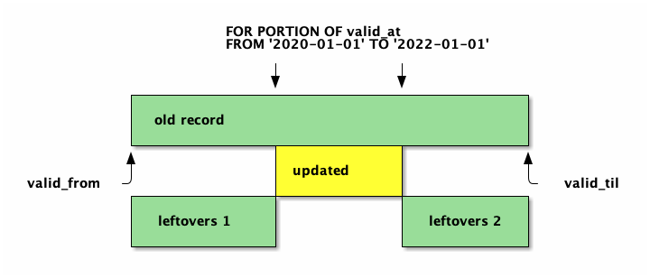

# Postgres Pipeline: Especially Emphasizing Execution

by Paul Jungwirth

Illuminated Computing

May 2023

Notes:

- Thank you, I'm Paul Jungwirth.
- I do independent consulting & development through my company Illuminated Computing.
- When I'm lucky I get to do Postgres work.
- I've been a minor contributor since 2016.
  - I worked on multiranges,
  - and since then I've been working on adding SQL:2011 temporal support.

- As a newish contributor, I've often wished for a comprehensive guide to hacking on Postgres.
- There are some great articles and talks out there already,
  but one place I've never found much help on is the executor phase.
- So this is my contribution to helping others pick up Postgres hacking:
  the bits I had to figure out on my own.


# Phases

- Parsing
- Analysis
- Rewriting
- Planning & Optimizing
- Executing

Notes:

- Before I dive into the details, here is a map of the territory.
- To execute a query, Postgres goes through several phases.
- It has to parse your SQL,
  Make sure it makes sense,
  Possibly expand views and apply rewrite rules,
  Build possible plan trees,
  Cost them and choose the best one,
  and finally run it!
- There are lots of talks about writing custom C functions for Postgres,
  and lots about the parsing and analysis phases.
    - And those are a great place to start---probably better than this talk actually.
  But I could find very little about the execution phase---
  which is where the real work is supposed to happen.
- So I'm going to rush a bit through the early phases
  so I can talk more about executor nodes, tuple table slots, etc.
- It's going to be desultory and digressive,
  but I hope two things will help:
  - I'm going to follow this pipeline structure,
  - and I'll use my temporal work as a running example.

- Of course PGCon is like the riskiest place to give a talk like this.
  - Here I am a Postgres dilettante you are all the real experts.
  - So I'll try to leave some time at the end for you to correct my mistakes.


# For Example

```text [|1|3|5-7|9-10|5-7]
ALTER TABLE ADD PERIOD valid_at (valid_from, valid_til)

PRIMARY KEY/UNIQUE (id, valid_at WITHOUT OVERLAPS)

UPDATE/DELETE FROM t
  FOR PORTION OF valid_at
  FROM '2020-01-01' TO '2030-01-01'

FOREIGN KEY (id, PERIOD valid_at)
  REFERENCES parent (id, PERIOD valid_at)
```

Notes:

- Here's the temporal stuff I'll use to keep things concrete.
- There are four parts:
  - (higlight) adding a PERIOD (which is a bit like a range but not a true column).
  - (highlight) adding a temporal primary key or unique constraint (which includes a PERIOD or (in Postgres) a range column).
  - (highlight) running a temporal UPDATE/DELETE, which targets just a span of time and leaves the other times untouched.
  - (highlight) adding a temporal foreign key.
- (highlight) Mostly I'll talk about `FOR PORTION OF`, because that's the most "interesting" command here.
  - DDL commands are just "utility commands" and skip most of this pipeline.
    - They are still parsed & analyzed ...
      but then we don't build up a plan or a tree of executor nodes.
      We just do it.
  - But SELECT and DML get the full experience.


# For Example



Notes:

- Here is a quick visualization of what FOR PORTION OF does.
  - The SQL:2011 standard says when we update the original row we should force the start/end bounds to the period targeted by FOR PORTION OF . . .
  - and then implicitly INSERT up to two new rows to preserve the "leftovers" the UPDATE didn't target.
  - The leftovers are green because they match the pre-update data.
    (Except we changed the start/end times.)
  - By the way this is the only picture you get in this whole talk.


# Why

```text
On Tue, Nov 14, 2017 at 9:43 AM Tom Lane <tgl@sss.pgh.pa.us> wrote:
>
> Robert is correct that putting this into the parser
> is completely the wrong thing.
> If you do that, then for example views using the features
> will reverse-list in the rewritten form,
> which we Do Not Want,
> even if the rewritten form is completely valid SQL
> (is it?).
> 
> . . .
> 
>       regards, tom lane
```

Notes:

- Why do all these phases matter?
  - I've noticed several patches being rejected because they do their work in the wrong phase.
    - There was a really cool temporal patch a few years ago that did nearly everything in the analysis phase. This quote is feedback on that patch.
    - Early versions of the MERGE command patch were rejected with similar feedback.
      - Robert Haas wrote an excellent review of that patch from 2019 giving specific reasons why you should do things in the right phase,
        as well as links to past feedback with yet more reasons.
        Robert and Tom's posts are both in the References at the end of my talk.
        I've been trying to find them again for years actually, but I could never get Google to give me what I wanted.
        Finally for this talk I downloaded all the mbox files and searched them locally.
          - (Sorry about that!)
          - But they are too good to get lost to obscurity.
          - They should really get linked from the Postgres development wiki.

  - So what's wrong with doing your work in analysis?
    - For one thing you want to keep the codebase organized.
      - But there are concrete reasons too.
    - When you describe a view, you won't get back the SQL you typed in.
    - The output from EXPLAIN will look funny.
      - Actually my own patch maybe approaches the line:
        FOR PORTION OF adds a qual (a WHERE condition basically)
        restricting it to rows that match the targeted timeframe.
        I decided that showing that in EXPLAIN seeemed helpful,
        although technically it's not something the user typed.
        No reviewers have complained about it yet.
        It may not always be appropriate though, depending on the feature.

  - At one point `FOR PORTION OF` was requiring a temporal PK (which was not really correct),
    and that meant it didn't work against an updateable view,
    even though the view included the range column referenced by FOR PORTION OF.
    Updateable views don't get handled until the rewrite phase.


# tcop/postgres.c
<!-- .slide: style="font-size: 80%" -->

```text [|1-2|1,3-4|1,3,5-7|1,8|1,9-12|1,13-17]
exec_simple_query
  pg_parse_query
  pg_analyze_and_rewrite
   parse_analyze
   pg_rewrite_query
     QueryRewrite
       RewriteQuery
  pg_plan_queries
  PortalDefineQuery
  PortalStart
    ExecutorStart
      ExecInitModifyTable
  PortalRun
    FillPortalStore
    PortalRunSelect
      ExecutorRun
        ExecModifyTable
```

Notes:

- Here are some of the major functions Postgres calls on its journey through the pipeline.
- There's parsing (highlight), analysis (highlight), rewriting (highlight).
  - The names here are kind of funny to me.
- planning (highlight)
- setting up the executor nodes (highlight)
- processing the executor nodes (highlight)


# Parsing

```c
/* src/backend/parser/gram.y */

for_portion_of_clause:
    FOR PORTION OF ColId FROM a_expr TO a_expr
      {
        ForPortionOfClause *n = makeNode(ForPortionOfClause);
        n->range_name = $4;
        n->range_name_location = @4;
        n->target_start = $6;
        n->target_end = $8;
        $$ = n;
      }
    | /*EMPTY*/         { $$ = NULL; }
  ;
```

Notes:

- Parsing & analysis are often discussed together.
  - This is just parsing.
- Postgres uses lex & yacc (or I should say flex & bison) to tokenize then parse your input, respectively.
- The big bison file is `gram.y`.
  - This defines the SQL grammar.
  - Here is a quote from it for the FOR PORTION OF clause.
  - When bison sees the symbols matching the rule, it runs the C code below.
- You can see a call to makeNode.
  - Parsing contructs a big parse tree made of these nodes.
  - Nodes are what flow through the pipeline.
  - We start with parse nodes,
    use those to make plan nodes, 
    and finally create exec nodes.


# Parse Nodes

```c
/* src/include/nodes/parsenodes.h */
/*
 * ForPortionOfClause
 *      representation of FOR PORTION OF <period-name>
 *                        FROM <t1> TO <t2>
 */
typedef struct ForPortionOfClause
{
    NodeTag     type;
    char       *range_name;
    int         range_name_location;
    Node       *target_start;
    Node       *target_end;
} ForPortionOfClause;
```

Notes:

- Here is a new type of parse node: a ForPortionOfClause.
- There are big high-level nodes like SelectStmt,
- down through clauses like GROUP BY or OVER,
- and expressions made of operators, functions, literals, column references, etc.

- There are functions to make a node (i.e. allocate memory for it),
  to copy a node, to print a node, to read a node back from what was printed.
- Until recently you had to write all these each time you added a node,
  but now there is some clever codegen that does it for you.
  - There is still some tree-walking code with big switch statements where you might need to handle your new node type.

- You will also see a lot of List members.
  - A List is also a Node, but it's a node that has a bunch of other nodes.
  - There are functions to build them, iterate over them, append to them.
  - When people say that Postgres is lispy, this is part of what they mean.
  - Actually a lightning talk on Postgres's Lisp history would be a lot of fun, if any of you are qualified to give that.

- Nodes & Lists are well-covered by other talks, so if you want to know more check the references at the end.


# Memory Contexts

```text
TopMemoryContext
PostmasterContext
CacheMemoryContext
MessageContext
TopTransactionContext
CurTransactionContext
PortalContext
ErrorContext
and more!
```

Notes:

So all these Nodes are getting allocated, right?
This is C isn't it?
Where do you think we free them?
We don't!

Postgres has an arena-based memory system.
Arenas are nested and have lifetimes from very broad to more specific:
For instance for the transaction, the current query, the function being called, the current row, etc.
When a context ends, everything in it gets freed.

To someone like me who writes a lot of Ruby and Python, this is awesome!
The delight of writing C with totally insoucient memory management makes me want to do more Postgres.


# Analysis

```c [|4|6-8|9-12|14]
static Query *
transformUpdateStmt(ParseState *pstate, UpdateStmt *stmt)
{
    Query      *qry = makeNode(Query);

    qry->resultRelation = setTargetTable(pstate, stmt->relation,
                                         stmt->relation->inh,
                                         true, ACL_UPDATE);
    if (stmt->forPortionOf)
        qry->forPortionOf = transformForPortionOfClause(
                pstate, qry->resultRelation,
                stmt->forPortionOf, true);

    transformFromClause(pstate, stmt->fromClause);
```

Notes:

- The bison file gives you a tree of what was typed,
  but it hasn't done any work yet to look up column names,
  validate your command, check permissions, etc.
- That's what the analysis phase does.
  - Here we can consult the database schema to find oids, types, etc.
- It will transform your parse nodetree (here an UpdateStmt) into a Query nodetree.
  You can see the top-level result node will be Query (highlight).
  The parse nodes should just capture what the user typed, as plainly as possible.
- So the first thing we're doing is looking up the table to update (highlight).
- Next if there was a `FOR PORTION OF` we translate that into plan nodes (highlight).
  - We feed in a `ForPortionOfClause`, we get back a `ForPortionOfExpr`, which is a different struct
    - with attribute numbers of the range or start/end columns,
    - also an Expression node turning the FROM & TO phrases into a range.
    - I'm not going to show all those details today though.
- Lots of the analysis work happens in functions named `transformThis` and `transformThat`,
  like here we process a `FROM` if there was one.
  - Btw do you notice we aren't getting a return value here?
    - But we *are* passing in the top-level parse state....


# RangeTblEntry

```c
typedef struct RangeTblEntry
{
    NodeTag     type;

    RTEKind     rtekind;        /* see above */
    Oid         relid;          /* OID of the relation */
    char        relkind;        /* relation kind (see pg_class.relkind) */
    int         rellockmode;    /* lock level that query requires on the rel */
    Index       perminfoindex;
    Query      *subquery;       /* the sub-query */
    /* . . . */
```

Notes:

- Something you use all over the place are `RangeTblEntry`s.
- The Query struct has a List called `rtable`,
  which holds a bunch of these structs.
  - When we process the FROM clause we're adding to that list.
- A range table is:
  1. not a database table (i.e. not a relation).
  2. has nothing to do with range types.
- It's a table as in a list of structs.
- Each struct is a quote-unquote range: which is basically a relation:
  - either a true persisted table,
  - or the result of a subquery or join,
  - or some other more exotic thing.
- So when your query joins a bunch of tables or subqueries, each FROM entry is a RangeTbl*Entry*: an entry in the range table.


# syscache

```c [|1-3|4|6|7-9|14|10|13|11]
HeapTuple perTuple = SearchSysCache2(PERIODNAME,
                                     ObjectIdGetDatum(relid),
                                     PointerGetDatum(range_name));
if (HeapTupleIsValid(perTuple))
{
    Form_pg_period per = (Form_pg_period) GETSTRUCT(perTuple);
    Oid rngtypid    = per->perrngtype;
    int start_attno = per->perstart;
    int end_attno   = per->perend;
    Type rngtype    = typeidType(per->perrngtype);
    char *range_type_name = typeTypeName(rngtype);
    . . .
    ReleaseSysCache(rngtype);
    ReleaseSysCache(perTuple);
}
```

Notes:

- Another thing you see all over the place are all these caches.
- Syscache lets you look things up in the system catalog tables.
- We call it a lot in analysis,
  so this seems like a good place to cover it.
- Here `FOR PORTION OF` is looking up the period name (higlight).
- You see we're calling `SearchSysCache2`.
  This is defined in `utils/cache/syscache.c`.
  We give it the cache name, here `PERIODNAME`. That determines the table to query, the index the use, and how big the cache should be.
  This is search *2* because we search based on two attributes. Here the relation id (i.e. the table), and the period name. That uniquely identifies a PERIOD. So those are the other arguments you see.
- We don't necessarily get a result (highlight), so we have to check if we got something,
  and maybe report an error if not.
- Then we cast the `HeapTuple` to a struct matching the `pg_period` table.
  - (pause) This line is kind of amazing actually.
- For simple types like ints and oids you can just pull them off the struct (highlight).
- When you're done you call `ReleaseSysCache` (highlight).
  - This isn't freeing memory but decrements a reference count
    so Postgres knows when to unlock the cache entry.
    If you don't call this it will be locked until the end of the transaction.
    If I recall correctly Postgres will scold you if you forget to do this.

- For fancier types there are helper functions you can use (highlight).
- Each PERIOD knows the range type used behind the scenes to implement various operations,
  so we look that up too.
- For the range type we have a nice helper function, typeidType.
  This is just defined with the parser code.
  In fact a `Type` is just a typedef'd `HeapTuple`, so we have to free that the same way (highlight).
- Another helpful function here is `typeTypeName`,
  which gives us a C-string for the type.


# lsyscache

```c
char *get_periodname(Oid periodid, bool missing_ok) {
 HeapTuple tp = SearchSysCache1(PERIODOID,
                                ObjectIdGetDatum(periodid));
 if (HeapTupleIsValid(tp)) {
   Form_pg_period period_tup = (Form_pg_period) GETSTRUCT(tp);
   char *result = pstrdup(NameStr(period_tup->pername)); 
   ReleaseSysCache(tp);
   return result;
 }
 
 if (!missing_ok)
   elog(ERROR, "cache lookup failed for period %d", periodid);
 return NULL;
}
```

Notes:

- Speaking of caches, there is also lsyscache.
- I don't know what the L stands for.
- It has a bunch of common helper routines on top of the syscache.
- They call `ReleaseSysCache` for you so they are convenient.
- It's common to call these during analysis, but really they're called anywhere.
- Here is a helper function I added.
  - This is used by the foreign key triggers.
  - Basically everything in lsyscache looks like this:
    - It searches the syscache,
    - it pulls something off the struct
    - it releases the tuple,
    - it returns what it found.
    - There is a convention to let the caller say whether or not to fail on missing data.
- Typically you use syscache if you need a bunch of things from the catalog row,
  and if you only need one thing (like a name or the oid) you use an lsyscache helper.


# typcache

```c [|2-4|5-7]
RangeType *r = DatumGetRangeTypeP(src->fp_targetRange);
TypeCacheEntry *typcache =
    lookup_type_cache(RangeTypeGetOid(r),
                      TYPECACHE_RANGE_INFO);
dst->fp_targetRange = datumCopy(src->fp_targetRange,
                                typcache->typbyval,
                                typcache->typlen);
```

Notes:

- And then the last cache you will surely use is the typcache.
- Types and operators are so important they have their own cache and helper functions.
  Not only do we need them to do almost anything,
  their info tends to be spread across a lot of tables, not just `pg_type`,
  so it would be expensive to look up all this stuff whenever we need it.
- This is all defined in `utils/cache/typcache.c`.
- Postgres assumes that types don't change very often.
  I mean int is never going out of style, right?
  So a `TypeCacheEntry` is never freed.
  This saves a lot of work---both for Postgres and for you.
  I guess if you built an application that operationally redfined types,
  you'd be leaking a lot of memory, but also you'd be little crazy.
- The typcache has some functions for domains and enums, but the only really essential function is `lookup_type_cache` (highlight).
  - A `TypeCacheEntry` is a big struct with lots of info, and you might not want all of it, so you can use constants like `TYPECACHE_RANGE_INFO` to say what you care about.
  - Here (highlight) we are using the type's size and whether it's pass-by-value to make a copy of a range.


# Analysis

```c [|4|5-8|9-10]
Node *target_start = transformForPortionOfBound(
        forPortionOf->target_start, true);
Node *target_end   = transformForPortionOfBound(
        forPortionOf->target_end, false);
FuncCall *fc = makeFuncCall(SystemFuncName(range_type_name),
              list_make2(target_start, target_end),
              COERCE_EXPLICIT_CALL,
              forPortionOf->range_name_location);
result->targetRange = transformExpr(
        pstate, (Node *) fc, EXPR_KIND_UPDATE_PORTION);
```

Notes:

- Here we're building an expression from the targeted range:
  the FROM and TO phrases.
- We get the individual bounds as nodes. (highlight)
  We almost don't need a separate function there,
  but it does some work to support an `UNBOUNDED` keyword.
- Next we make a function call node. (highlight)
  This is calling a range constructor of the appropriate type,
  passing in the bounds.
- This `range_name_location` item you see is something we ask bison to set all over.
  It helps us point to the right place if we need to report an error.
- And finally we call transform on our node (highlight).
  - One thing this does is make sure you aren't calling unsupported functions.
  - For instance you can't run a subquery here,
    or call a window function.
- We stick this expression on our struct so we can use it later.


# Analysis

```c [|7-8]
Expr *rangeSetExpr = (Expr *) makeSimpleA_Expr(
        AEXPR_OP, "*", (Node *) copyObject(rangeExpr),
        (Node *) fc, forPortionOf->range_name_location);
rangeSetExpr = (Expr *) transformExpr(
        pstate, (Node *) rangeSetExpr, EXPR_KIND_UPDATE_PORTION);

TargetEntry *tle = makeTargetEntry(
        rangeSetExpr, range_attno, range_name, false);
targetList = lappend(targetList, tle);

/* Mark the range column as requiring update permissions */
target_perminfo->updatedCols =
        bms_add_member(target_perminfo->updatedCols,
                       range_attno - FirstLowInvalidHeapAttributeNumber);
```

Notes:

- Here we've got some code to set the new bounds on the record.
- We take the old bounds and intersect them with the targeted range.
- You can see are making this TargetEntry or TLE. TLE for Target List Entry.
- In an update query you have one of these for each column you're setting.
  - In a select you use them for the SELECT'd columns.
- Also we add it to the list of columns that need permission checks.
- A TLE is a lot like an RangeTblEntry: one item in a List of structs.


# Rewriting

- `VIEW`s
- `RULE`s
- `Query` -> List (of `Query`)

Notes:

I don't want to spend much time on rewriting, but this is where we expand VIEWs and apply RULEs.
The main functions take a Query node and return a List of zero or more Query nodes.
In the really easy cases we're just wrapping the passed-in Query node.


# Rewriting

```c [|1|8-12]
foreach(lc, parsetree->forPortionOf->rangeSet)
{
    TargetEntry *tle = (TargetEntry *) lfirst(lc);
    TargetEntry *view_tle;

    if (tle->resjunk) continue;

    view_tle = get_tle_by_resno(view_targetlist, tle->resno);
    if (view_tle != NULL &&
            !view_tle->resjunk &&
            IsA(view_tle->expr, Var))
        tle->resno = ((Var *) view_tle->expr)->varattno;
    else
        elog(ERROR, "attribute number %d not found in view targetlist", tle->resno);
}
```

Notes:

- I did have to do little bit here to make sure we could use `FOR PORTION OF` against an updatable view.
- If your feature should work against a view, maybe you need to do something here.
- This might also be a worthwhile place for doing things you aren't supposed to do in analysis.
- For example with UPDATE FOR PORTION OF, we are implicitly setting the `PERIOD` start/end columns.
  - As you saw we added `TargetEntry` nodes for those columns.
  - Our `forPortionOfExpr` has a list of TLEs for the implicitly-set columns, separate from the ones the user sets explicitly. (highlight)
  - In you have an updatable view, we need to convert our TLE from the view's attno to the underlying table's (highlight).
- That's it for rewriting.


# Planning & Optimizing

- `Query` -> `PlannedStmt`

Notes:

- For each Query node the planner returns a PlannedStmt node.
  - So now we're transitioning from parse nodes to plan nodes.
    - There is an "abstract superclass" Plan node.
      - These are things you might recognize from EXPLAIN:
      - Examples are Join, Sort, CteScan, etc.
    - OTOH a lot of node types are shared between parsing & planning:
      - RangeTblEntry
      - TargetEntry
      - Expression bits
  - There is about one line in my patch here to copy my new struct from the parse tree to the plan tree.
    - You could do more transformation at this stage if you like.
  - The include files are nicely separated:
    - nodes/primnodes.h - "primitive nodes", often shared by different phases
    - nodes/parsenodes.h
    - nodes/plannodes.h
    - nodes/execnodes.h
  - But you surely have to do something here to move your stuff over.

- The real work of this phase is to find the best way to implement your plan.
- For each table in your query the planner will generate several "Paths"
  then choose the best one: maybe a full-table scan, maybe an index scan, maybe a bitmap index scan.
- Also for each pair of joined relations the planner will generate Paths to implement the join.
  - One relation is the outer and the other the inner.
  - It will consider a nested loop join, a hash join, etc.
- So all these paths get an estimated cost, and the planner chooses the best one.
- I haven't done much here.
  - When I worked on multiranges I had to do some work to collect statistics about them and use those to make selectivity estimates.
  - And that's all I know about the planner!


# Executor

```text [|1,9-10|2,11|2-8|11-13,16-18]
PortalStart
  ExecutorStart
    CreateExecutorState
    InitPlan
      ExecInitNode
        ...
        ExecInitModifyTable
        ...
PortalRun
  PortalRunSelect
    ExecutorRun
      ExecProcNode
        ExecModifyTable
```

Notes:

- Once we're ready to run the query, we pass our plan tree to the executor phase.
- This goes through a Portal (highlight), which is basically a door to pass result tuples from the backend to the client (or maybe directly to stdout).
  - Mostly this is how we implement cursors.
  - We can ignore it more or less.
- But the portal functions call ExecutorStart and ExecutorRun (highlight).
- ExecutorStart (highlight) sets up . . . another node tree.
  - `CreateExecutorState` creates an EState struct which has info about the overall execution.
  - Most plan nodes require some mutable state to execute, so each of them gets a corresponding PlanState node.
      - The struct is called PlanState but I'll refer to them as executor nodes.
    - Plan & PlanState are like counterparts.
    - You can imagine these parallel trees.
    - So we have to call ExecInitModifyTable and ExecInitThis and ExecInitThat.
  - ExecInitNode knows which init function to call for each kind of plan node.
    - Basically it's a big switch statement.
    - Then whatever it calls recursively calls the right init function for its own children,
      and so on.
      Or maybe they call ExecInitNode again.
        - That's what ExecInitModifyTable does to set up its source of tuples to insert/update/delete.
          - It doesn't care the specific node type that is giving it tuples,
            so it lets ExecInitNode dispatch for it.
- And then `ExecutorRun` (highlight) actually does the work.
- There are `ExecutorFinish` and `ExecutorEnd`
  as well as node-specific end functions, but I'm going to skip those.


# Executor

```c [|4|5|6|7]
typedef struct PlanState
{
    pg_node_attr(abstract)
    NodeTag     type;
    Plan       *plan;
    EState     *state;
    ExecProcNodeMtd ExecProcNode;
    ...
```

Notes:

- Here is what our executor nodes inherit from.
- Each one has a type, just like any node (highlight)
- Each gets a reference to its plan node (highlight).
  - That's it's counterpart.
  - Whereas the PlanState is mutable, the Plan node is stable for the whole executor phase.
- They all reference the top-level EState struct (highlight).
- They also each reference a function to process their kind of executor node (highlight).
  - Later we'll chase these function pointers to do all the work.
- There's a lot more stuff in this struct, but I'll skip it for now.


# Executor

```c
ExprState *exprState = ExecPrepareExpr(
        (Expr *) forPortionOf->targetRange, estate);
Datum targetRange = ExecEvalExpr(exprState, econtext, &isNull);
resultRelInfo->ri_forPortionOf->fp_targetRange = targetRange;
```

Notes:

- Here is a bit of what we do to init our ForPortionOfState.
  - Remember we're not running the row-by-row update yet, just the node init.
- We need to evaluate the FROM and TO parameters and turn those into a range.
  - The TO & FROM can't change row-by-row, so we can do it up front here.
  - We built this expression back in the analysis phase;
    now is our chance to evaluate it.
  - In general we expect to get constants here.
  - They are also allowed to be functions like `NOW()` or arithmetic like `NOW() + INTERVAL '1 day'`.


# Executor

```c [|3-5|9-11|12-14]
/* Initialize slot for the existing tuple */

resultRelInfo->ri_forPortionOf->fp_Existing =
    table_slot_create(resultRelInfo->ri_RelationDesc,
                      &mtstate->ps.state->es_tupleTable);

/* Create the tuple slots for INSERTing the leftovers */

resultRelInfo->ri_forPortionOf->fp_Leftover1 =
    ExecInitExtraTupleSlot(mtstate->ps.state, tupDesc,
                           &TTSOpsVirtual);
resultRelInfo->ri_forPortionOf->fp_Leftover2 =
    ExecInitExtraTupleSlot(mtstate->ps.state, tupDesc,
                           &TTSOpsVirtual);
```

Notes:

- Another thing we do in the Init step is create some TupleTableSlots.
- A TupleTableSlot is a place to hold a tuple.
  - We saw this briefly before.
- We need a place for three tuples:
  - one for the old version of the row we just updated,
  - two for the "leftover" rows we want to insert:
    - one for the time before the target range, one after.
- I'm going to say much more about TupleTableSlots in a moment,
  - but here just see what we're doing:
  - (highlight) we make the first one with `table_slot_create`.
  - (highlight) we make the second one with `ExecInitExtraTupleSlot`.
  - (highlight) we make another one with `ExecInitExtraTupleSlot`.


# Executor

```text
ExecutorRun
  ExecutePlan
    for (;;) {
      TupleTableSlot *slot = node->ExecProcNode(node);
      if (TupIsNull(slot))
          break;
    }
}
  
```

Notes:

- Okay so that's `ExecutorStart`, which gets us ready to call `ExecutorRun`.
- This calls ExecutePlan,
- And that calls ExecProcNode, which is the partner of ExecInitNode, which we saw above.
  - ExecProcNode is a tiny inline function that calls the node's function pointer.
  - We call it over & over, and each time it processes one row and returns the result.
  - The result is a `TupleTableSlot`: like we just saw!
  - If the node has children, somewhere in its proc function it calls the proc function for those children too.
    - For instance maybe you have a node to do a NestedLoop, which you've probably seen in `EXPLAIN` output.
      - It needs the rows from its inner & outer relations, so it calls the proc function for those nodes.
      - It doesn't care what kind of nodes those are.
        It calls `ExecProcNode` which runs the function pointer.
    - So we've got this whole tree of proc functions passing around tuples.
  - Incidentally using function pointers makes it easy to inject instrumentation.
    - I haven't checked but I'm betting that's how `EXPLAIN ANALYZE` works.


# Executor

```text [|2|5-8]
for (;;) {
  context.planSlot = ExecProcNode(subplanstate);
  if (TupIsNull(context.planSlot)) break;

  switch (operation) {
    case CMD_UPDATE:
      slot = ExecUpdate(...);
  }
}
```

Notes:

- Here are some bits from ExecModifyTable.
  - We use this same node for INSERT, UPDATE, DELETE, and MERGE.
- You can see we're calling the proc function of our subplan to get rows (highlight),
  - This is the row we want to update, or delete, or insert.
- and then we call a function for the specific operation we want (highlight).
- ExecUpdate will call ExecUpdatePrologue, ExecUpdateAct, and ExecUpdateEpilogue.


# Executor

```c [|1-2|3-4|6-8]
RangeType *oldRange = slot_getattr(oldtupleSlot,
        forPortionOf->rangeVar->varattno, &isNull);
RangeType *targetRange = DatumGetRangeTypeP(
        resultRelInfo->ri_forPortionOf->fp_targetRange);

range_leftover_internal(typcache,
        oldRangeType, targetRangeType,
        &leftoverRangeType1, &leftoverRangeType2);
```

Notes:

- The Epilogue is where we stick in our new code.
  - Recall that if the UPDATE or DELETE had any leftovers, we need to insert records for that.
- All this happens in a new function called ExecForPortionOf.
- It gets the row's old range value (highlight).
- It gets the target range that we set up above (built from the FROM & TO phrases) (highlight).
- And it finds out if there are any leftovers to the left or right (highlight)
  - These leftover variables get set. They're more `RangeType` pointers.


# Executor

```c [|3-4|5|7-9|11-12|]
if (!RangeIsEmpty(leftoverRangeType1))
{
  HeapTuple oldtuple = ExecFetchSlotHeapTuple(
          oldtupleSlot, false, NULL);
  ExecForceStoreHeapTuple(oldtuple, leftoverTuple1, false);

  set_leftover_tuple_bounds(leftoverTuple1, forPortionOf,
                            typcache, leftoverRangeType1);
  ExecMaterializeSlot(leftoverTuple1);

  ExecInsert(context, resultRelInfo, leftoverTuple1,
             node->canSetTag, NULL, NULL);
}
```

Notes:

- And now if either of those leftover ranges are non-empty,
- it takes the pre-update values from oldtuple (highlight),
  copies them into our leftover TupleTableSlot (highlight),
  changes the start/end values (highlight),
  and does an Insert with it (highlight).
- This (highlight for all) is for leftoverRangeType1 but there is similar code for the other side.
  In fact I should probably move this into a little helper function.
- All this work uses TupleTableSlots,
  so let me talk about those, and then I'll run through this code again more slowly.


# Tuple Table Slots

```c [|3|8-9|7|10|6]
typedef struct TupleTableSlot
{
    NodeTag     type;
    uint16      tts_flags;      /* Boolean states */
    AttrNumber  tts_nvalid;     /* # of valid values in tts_values */
    const TupleTableSlotOps *const tts_ops; /* implementation of slot */
    TupleDesc   tts_tupleDescriptor;    /* slot's tuple descriptor */
    Datum      *tts_values;     /* current per-attribute values */
    bool       *tts_isnull;     /* current per-attribute isnull flags */
    MemoryContext tts_mcxt;     /* slot itself is in this context */
    ItemPointerData tts_tid;    /* stored tuple's tid */
    Oid         tts_tableOid;   /* table oid of tuple */
} TupleTableSlot;
```

Notes:

- So what are these TupleTableSlots anyway?
- If you're working in the executor you'll probably need to use one.
- I couldn't find any talk or article talking about these things.
  - Fortunately the Postgres source has great comments, and most directories have a README.
- Of course a tuple is more-or-less a row.
- A "tuple table" is how the executor deals with processing tuples.
  - It's a table like the Range Table is a table: a list of structs.
    - You have Target(List)Entry, RangeTblEntry, and TupleTableSlot: all the same pattern.
  - Each tuple is kept in a TupleTableSlot.
  - Guess what? This is a node too (highlight)! Lots of the exec nodes have these as members.

- You can see we've got a list of `Datum`s and null flags (highlight).
  - Every other intro to Postgres talks about Datums, so I've kind of shied away from giving you lots of details here.
  - But basically a Datum is a single value: maybe from a column, or an evaluated expression, or whatever.
    - If you write your own C functions you get Datums in and send a Datum out.
    - It's 64 bits wide, or maybe 32: basically a pointer size.
    - It doesn't tell you what type of data it's holding.
  - Then there are functions and macros to convert them to/from concrete types, e.g. `DatumGetInt64` or `Int64GetDatum`.
    - If the type is something small enough to be pass-by-value, this should be just a cast.
    - Otherwise the `Datum` is a pointer and might be TOASTed, so `DatumGetFoo` will also de-toast it for you.
    - Lots of links in my references have more details.

- So these two arrays let us get at the data in the tuple, but there's lots more info here *about* the tuple.
  - For example the tuple descriptor (highlight), which tells us how many attributes there are and what their types are---or actually the whole `pg_attribute` record if possible.
  - Or the memory context (highlight), etc.
    - This is where we allocated the slot, not necessarily the tuple.

- Now there are four kinds of TupleTableSlot:
  - You see this `tts_ops` field (highlight).
    - That points to an 'Ops struct which is a big list of function pointers.
    - So this is our dynamic dispatch and basically determines what kind of TupleTableSlot we've got.


# Tuple Table Slots
## `TTSOpsHeapTuple`

```c [|4|5]
typedef struct HeapTupleTableSlot
{
    pg_node_attr(abstract)
    TupleTableSlot base;
    HeapTuple   tuple;          /* physical tuple */
    uint32      off;            /* saved state for slot_deform_heap_tuple */
    HeapTupleData tupdata;      /* optional workspace for storing tuple */
} HeapTupleTableSlot;
```

Notes:

- So let's start with HeapTupleTableSlots.
- Here is our C-style inheritance: we're a subclass of TupleTableSlot (highlight).
- We have this reference to a HeapTable (highlight).
  - That's defined in access/htup.h.
  - It's got the memory that actually holds the tuple data.
  - A HeapTupleTableSlot points to palloc'd memory, so that's what's in there.
- If you want to read what's in there, you can call `slot_getattr`.
  - That will give you the corresponding Datum/null value.
  - Actually `slot_getattr` calls one of the 'ops function pointers.
    For heap slots, it's going to pull the data out of this `HeapTuple`
    and cache it in the Datum/isnull arrays we saw earlier.


# Tuple Table Slots
## `TTSOpsHeapTuple`

```c [1-2]
RangeType *oldRange = slot_getattr(oldtupleSlot,
        forPortionOf->rangeVar->varattno, &isNull);
RangeType *targetRange = DatumGetRangeTypeP(
        resultRelInfo->ri_forPortionOf->fp_targetRange);

range_leftover_internal(typcache,
        oldRangeType, targetRangeType,
        &leftoverRangeType1, &leftoverRangeType2);
```

Notes:

- So jumping back to the code in our Init node,
  we're calling `slot_getattr` on the pre-update tuple slot.


# Tuple Table Slots
## `HeapTuple`

```c [1-3|6]
HeapTuple perTuple = SearchSysCache2(PERIODNAME,
                                     ObjectIdGetDatum(relid),
                                     PointerGetDatum(range_name));
if (HeapTupleIsValid(perTuple))
{
    Form_pg_period per = (Form_pg_period) GETSTRUCT(perTuple);
    Oid rngtypid    = per->perrngtype;
    int start_attno = per->perstart;
    int end_attno   = per->perend;
    . . .
    ReleaseSysCache(perTuple);
}
```

Notes:

- While we're talking about HeapTuples, remember this?
- Back when we called syscache, we were getting HeapTuples!
  - This isn't a slot, which are just things to help out the executor.
  - This is just the tuple.
- And back there we used `GETSTRUCT`
  - which just follows the pointer to the real tuple data and casts it to a struct.
  - That works for catalog tables because we have compile-time structs for them.
  - For ordinary user tables we use `slot_getattr`.


# Tuple Table Slots
## `TTSOpsBufferHeapTuple`

```c
typedef struct BufferHeapTupleTableSlot
{
    pg_node_attr(abstract)

    HeapTupleTableSlot base;

    Buffer      buffer;         /* tuple's buffer, or InvalidBuffer */
} BufferHeapTupleTableSlot;
```

Notes:

- Now here's a next type of TupleTableSlot: A BufferHeapTupleTableSlot.
- Whereas a HeapTupleTableSlot is stored in palloc'd memory, a BufferHeapTupleTableSlot is stored in our disk buffer.
- In fact the HeapTuples you get from syscache are examples of this.
- For these tuples we need to take & release buffer pins, not alloc & free memory.
  - A pin says "Don't throw this buffer page away; I'm using it!"
  - Like you're pinning it in place.
- Looking at tuples in the buffer cache is sort of the normal case,
  but this is maybe the most complicated.
  You can see it's a "subclass" of `HeapTupleTableSlot`, just with a pointer to its buffer.

- The executor will use these all over the place.
- It sort of helps explain why we have TupleTableSlots in the first place.
- Suppose you're a SeqScan Node.
  - Your Init function sets up a TupleTableSlot to hold the rows you're going to return.
  - Then in your proc node you're asking an Access Method for the tuples from the table or index,
    and you call `ExecStoreBufferHeapTuple` to put it into your TupleTableSlot.
    - So that puts a pin in the buffer page,
      then it stores a pointer to the `HeapTuple` struct.


# Tuple Table Slots
## `TTSOpsMinimalTuple`

Notes:

- A minimal tuple is like a palloc'ed tuple, but it has no system columns.
  - There is also a header struct that we leave out.
- You might use this for computed tuples that don't come from disk.
- I looked around to see where we use this:
  - hash joins
  - aggregate with GROUP BY
- I don't have too much to say here.
- It's like a HeapTupleTableSlot, but when we don't need the extra stuff from a physical tuple.


# Tuple Table Slots
## `TTSOpsVirtual`

```c [|7-14||5|10,13]
/* Initialize slot for the existing tuple */

resultRelInfo->ri_forPortionOf->fp_Existing =
    table_slot_create(resultRelInfo->ri_RelationDesc,
                      &mtstate->ps.state->es_tupleTable);

/* Create the tuple slots for INSERTing the leftovers */

resultRelInfo->ri_forPortionOf->fp_Leftover1 =
    ExecInitExtraTupleSlot(mtstate->ps.state, tupDesc,
                           &TTSOpsVirtual);
resultRelInfo->ri_forPortionOf->fp_Leftover2 =
    ExecInitExtraTupleSlot(mtstate->ps.state, tupDesc,
                           &TTSOpsVirtual);
```

Notes:

- The last type of TupleTableSlot is Virtual.
- This doesn't have its own tuple storage.
  - It can be a nice optimization to prevent copying.
  - Going back to our SeqScan node, it's going to pass its results to the parent node,
    and maybe it will put them into its own TupleTableSlot.
    - VirtualTupleTableSlots are great for this.
- Also unlike the other types, the Datum/isnull arrays are the authoritative data:
  - You can set them, and then do something with the tuple (like insert it).

- So here (highlight) we are making a couple virtual TupleTableSlots for our leftovers.
- It's interesting to ask why this is different from the slot just above (highlight)?
  - Well `table_slot_create` will give us a tuple slot that matches the Relation you pass in---
    here it should be a BufferHeapTupleTableSlot.
  - For the leftovers we want a Virtual one.
  - In all three cases the tuple descriptor matches the table we're updating.
    - The lower functions need us to pass that in by hand.
      - That's tupDesc here.
    - But `table_slot_create` gets the descriptor automatically off the Relation struct.
  - Finally where do these slots go? In the tuple table!
    - At the top you see us pass the tuple table (highlight), which is part of the top-level executor state.
      - That's a List node and the slot gets appended there.
      - To me it's sort of reassuring to glimpse the table these slots get put in.
    - In the bottom we're also passing the executor state, which gives those functions access to the same list.


# Tuple Table Slots
## `TTSOpsVirtual`

```c [|1-2|3|5-6|7|9-10|11-12]
HeapTuple oldtuple = ExecFetchSlotHeapTuple(
        oldtupleSlot, false, NULL);
ExecForceStoreHeapTuple(oldtuple, leftoverTuple1, false);

set_leftover_tuple_bounds(leftoverTuple1, forPortionOf,
                          typcache, leftoverRangeType1);
ExecMaterializeSlot(leftoverTuple1);

ExecInsert(context, resultRelInfo, leftoverTuple1,
           node->canSetTag, NULL, NULL);
```

Notes:

- There are lots of functions for what you can *do* with TupleTableSlots:
  - create them, get the tuple out, store a tuple in, etc.
  - To see the API surface I'd just look at the include files.
  - But FOR PORTION OF gives us some examples:
- We've got our tuple table slots,
  and here is our code again that actually does something with them.
- Here (highlight) we pull out the old version of the row.
  This should just hand us back the reference, 
  but if we said `true` instead of `false` it would materialize the tuple
  which guarantees the slot "owns" the tuple, basically by making its own copy.
  We're about to copy it anyway, so we don't need that.
- Here (highlight) we copy it into our virtual tuple.
  - This sets the Datum/isnull arrays.
  - But if some Datums are pass-by-reference, they still point back into the HeapTuple.
- Then (highlight) we compute the new start/end times.
  - This is going to put a different range into our Datum array.
    - Or if we've got a PERIOD, it will update the Datums for the start/end columns.
  - And last (highlight) `ExecMaterializeSlot` makes the tuple "ready".
    For a virtual slot, it looks at all the Datums,
    and whichever are pass-by-reference, it copies them into the slot's memory context.
  - So now we've got our own tuple that isn't pointing into someone else's space.
- And that means we can insert it.


# Thank You!

Notes:

- Okay, that's the end of our journey.
  Thank you for listening. Here are some references (highlight).


# References
<!-- .slide: style="font-size: 45%; text-align: left" class="bibliography" -->

1. Selena Deckelmann, *So, you want to a developer*, 2011. https://wiki.postgresql.org/wiki/So,_you_want_to_be_a_developer%3F

1. Laetitia Avrot, *Demystifying Contributing to PostgreSQL*, 2018. https://www.slideshare.net/LtitiaAvrot/demystifying-contributing-to-postgresql

1. Neil Conway and Gavin Sherry, *Introduction to Hacking PostgreSQL*, 2007. http://www.neilconway.org/talks/hacking/hack_slides.pdf and https://www.cse.iitb.ac.in/infolab/Data/Courses/CS631/PostgreSQL-Resources/hacking_intro.pdf

1. Greg Smith, *Exposing PostgreSQL Internals with User-Defined Functions*, 2010. https://www.pgcon.org/2010/schedule/attachments/142_HackingWithUDFs.pdf

1. Hironobu Suzuki, *The Internals of PostgreSQL*, 2012. http://www.interdb.jp/pg/

1. Egor Rogov, *Indexes in PostgreSQL*, 2019. https://habr.com/ru/companies/postgrespro/articles/441962/

1. Tom Lane, *Re: [HACKERS] [PROPOSAL] Temporal query processing with range types*, pgsql-hackers mailing list, 2017. https://www.postgresql.org/message-id/32265.1510681378@sss.pgh.pa.us

1. Robert Haas, *Re: MERGE SQL statement for PG12*, pgsql-hackers mailing list, 2019. https://www.postgresql.org/message-id/CA%2BTgmoZj8fyJGAFxs%3D8Or9LeNyKe_xtoSN_zTeCSgoLrUye%3D9Q%40mail.gmail.com

1. Paul Jungwirth, https://github.com/pjungwir/pgcon-2023-talk-exec-phase

Notes:

- I learned a ton from these other talks and articles.
- I know I skipped a lot of stuff, but that's because they cover it so well already.
- You can also find this talk's github repo on there.
- Now I'm happy to answer questions or accept corrections!
